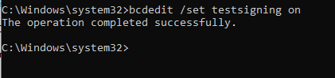
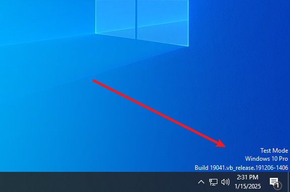
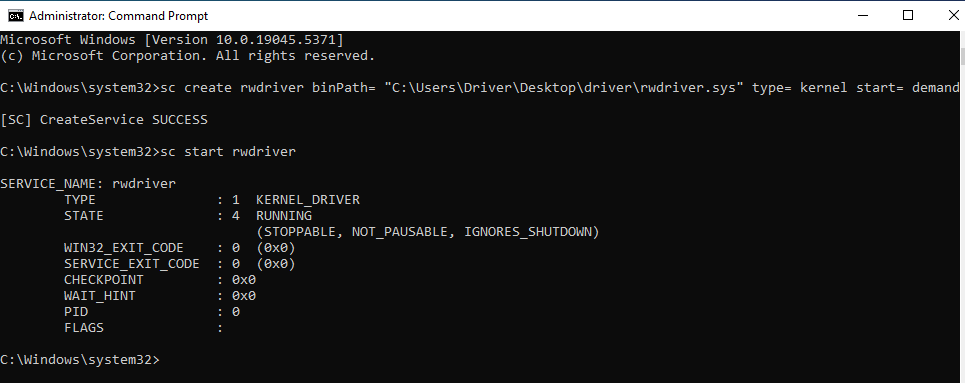
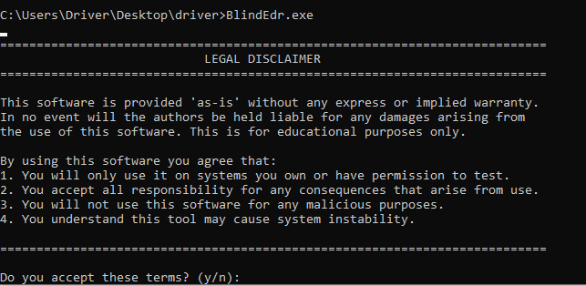
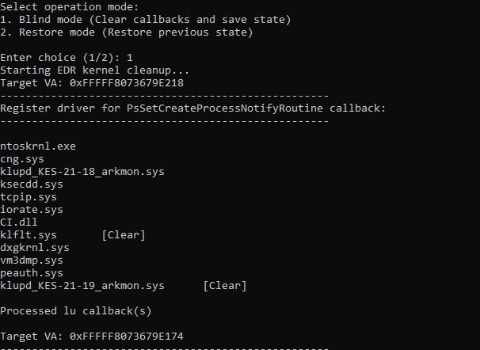
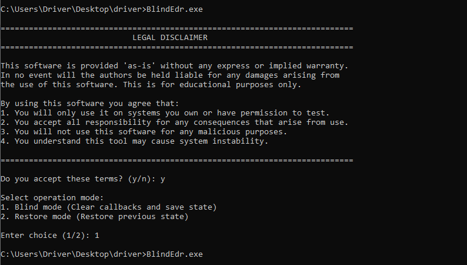
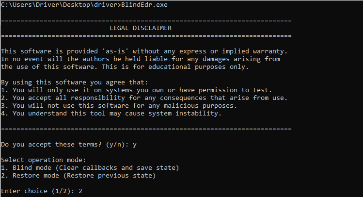
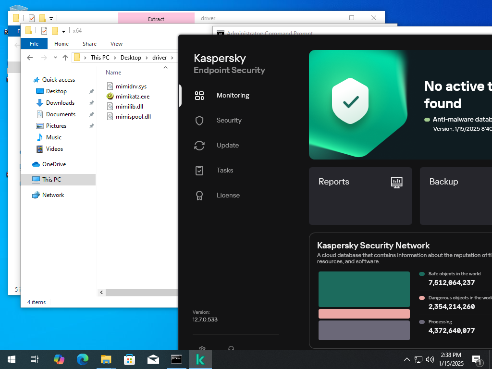
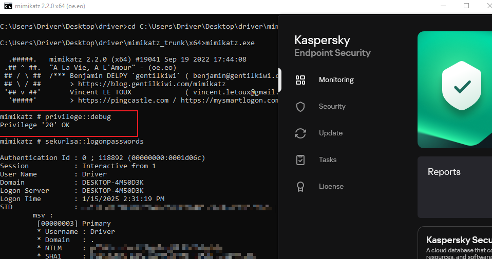
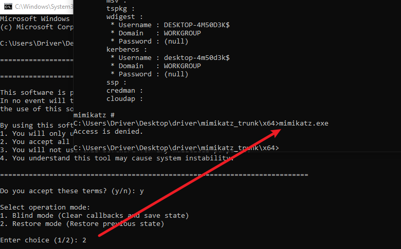

# Nyx-BlindEdr

# Disclaimer

This project, designed to blind EDR (Endpoint Detection and Response) systems, is strictly intended for educational purposes only. The content, tools, and techniques provided are meant solely for demonstrating security concepts and improving cybersecurity knowledge.

The creators and contributors of this project do not condone, promote, or support any illegal or unethical use of the materials provided. Any misuse of this project for malicious purposes is strictly prohibited and entirely the responsibility of the individual involved.

By using this project, you agree to comply with all applicable laws and regulations and assume full accountability for your actions.


# Usage

Driver Project: [k3lpi3b4nsh33/rwdriver](https://github.com/k3lpi3b4nsh33/rwdriver)


**Enable Windows Test Mode**

- To begin, enable Windows Test Mode to allow unsigned drivers to load. Once enabled, restart your system to apply the changes.






**Create and Start the Driver Service**

- Use the following commands to create and activate the driver service:

  ```
  sc create rwdriver binPath= "C:\Users\Driver\Desktop\driver\rwdriver.sys" type= kernel start= demand  
  sc start rwdriver  
  ```

This will load the kernel driver required for the functionality of this project.



**Features and Operation**

- Input `1` to enable the blinding functionality.
- Input `2` to restore the system from the blinding effect (this requires a valid **MemoryFile.data**).







**Details of the Blinding Effect**

- When the "debug" macro is removed from the build, the program runs silently with no output or notification, ensuring stealth operation.







The tool operates without detection because filters have been cleared, allowing it to bypass standard security measures.



It directly targets security solutions like Kaspersky, overriding their functionality. For example, tools like **mimikatz** can operate without interference.




Once the blinding effect is restored, access to certain system resources is entirely disabled, reinforcing security measures.



# Thanks
This project was largely inspired by [RealBlindingEDR](https://github.com/myzxcg/RealBlindingEDR). Start with a simple small driver and then make driver function calls.
